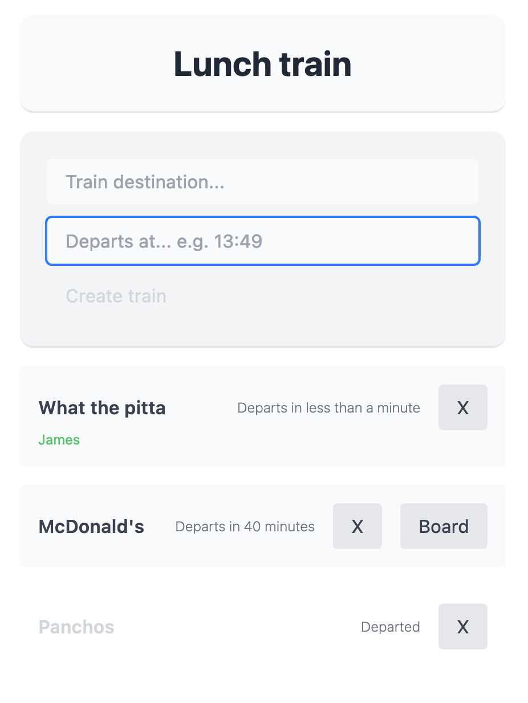

# Lunch Train - [View Demo](lunch-train.vercel.app)

-------

#### Inspired by the [Lunch train slack app](https://slack.com/apps/A1BES823B-lunch-train).

Just a throwaway app to lean about the T3 stack, most notibly [TRPC](https://trpc.io/) (which is actually amazing btw) with Prisma and NextJS.

Using the `create-t3-app` starter cli, found at [Init.tips](https://init.tips/)

### Todo
- [x] Some error handling.
- [ ] Remove yourself from a train.
- [ ] Add your own name when you board.
- [ ] Departure push notifications.
- [ ] Delays to departure.
- [ ] Where the meeting place is?
- [ ] Only delete trains you've created.
- [ ] Delay your own train.